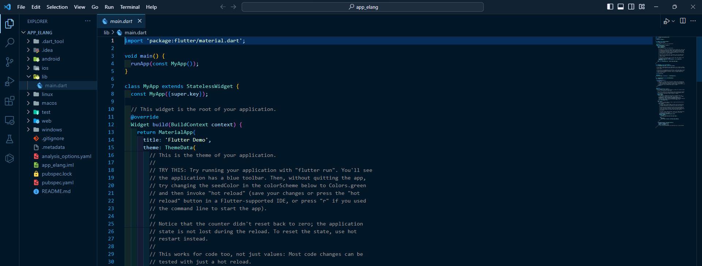
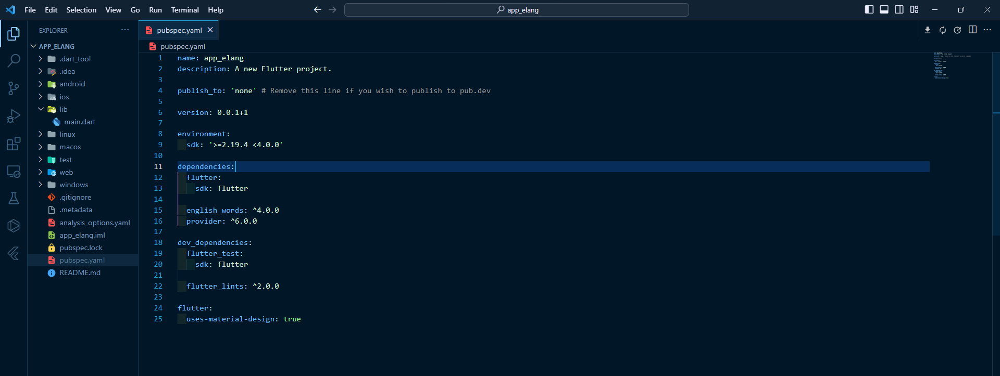
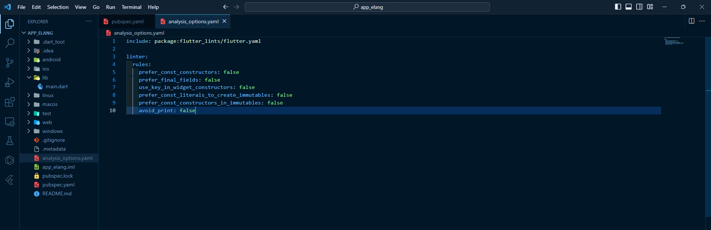
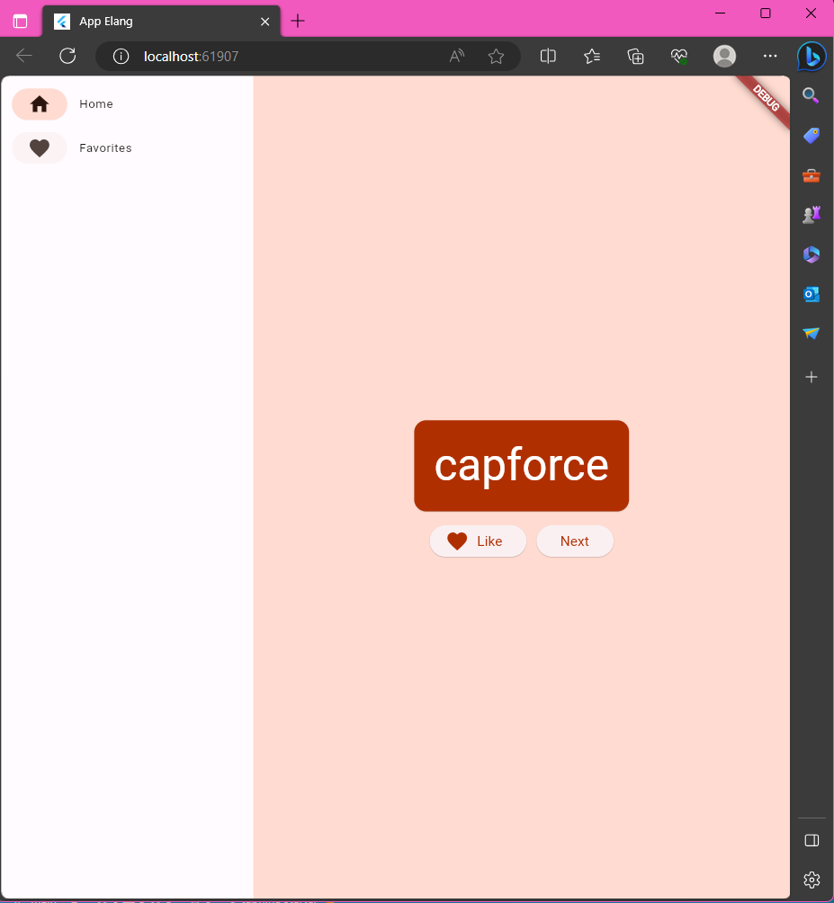
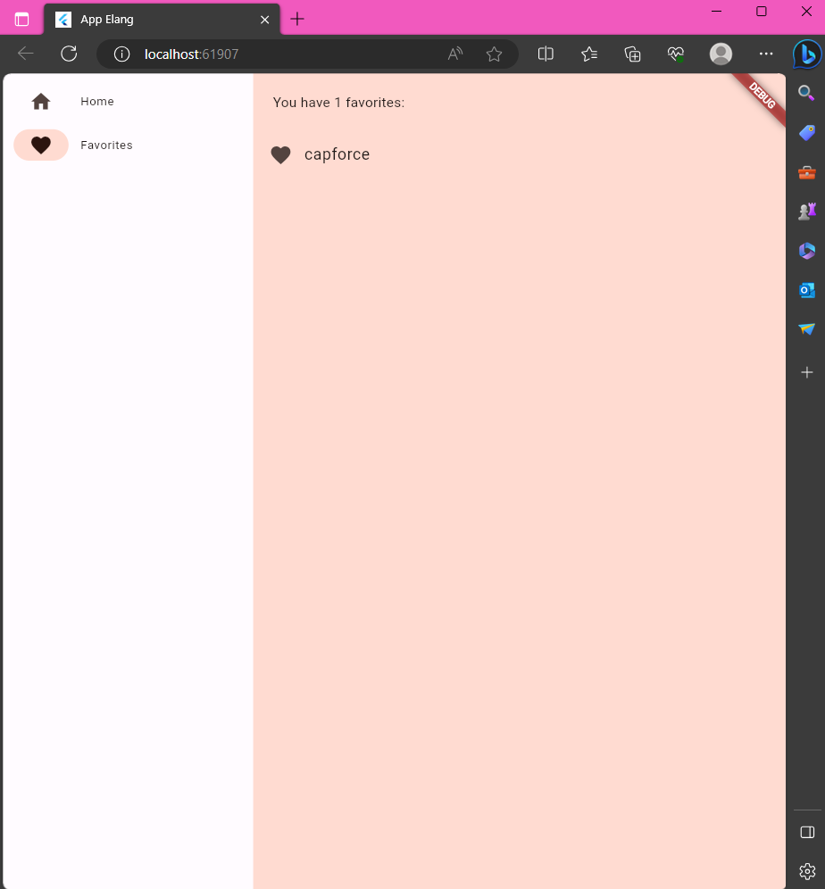
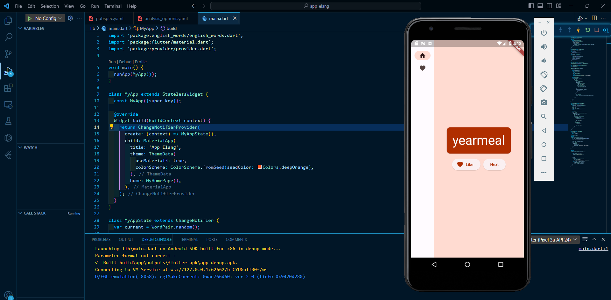
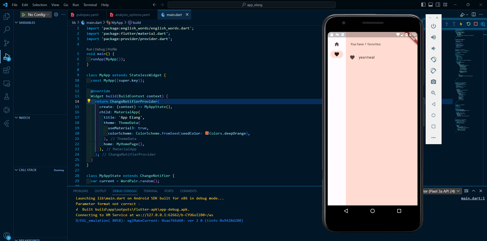

# <b>Laporan Tugas Codelabs Pertemuan 5</b>
<b> Nama: Elang Putra Adam

Kelas: TI 3G

NIM: 2141720074 </b>

# <b>Pertanyaan</b>
buka https://jti-polinema.github.io/flutter-codelab/16-flutter-fundamental-bagian-1/#7

1. Selesaikan Praktikum 3 dan 4, lalu dokumentasikan dan push ke repository Anda berupa screenshot hasil pekerjaan beserta penjelasannya di file README.md!
2. Pada praktikum 4 mulai dari Langkah 3 sampai 6, buatlah file widget tersendiri di folder basic_widgets, kemudian pada file main.dart cukup melakukan import widget sesuai masing-masing langkah tersebut!
3. Selesaikan Codelabs: Your first Flutter app, lalu buatlah laporan praktikumnya dan push ke repository GitHub Anda!
4. README.md berisi: capture hasil akhir tiap praktikum (side-by-side, bisa juga berupa file GIF agar terlihat proses perubahan ketika ada aksi dari pengguna) di browser dan perangkat fisik (device) dengan menampilkan NIM dan Nama Anda sebagai ciri pekerjaan Anda. Jika mode developer di perangkat HP Anda belum aktif, silakan cari di internet cara mengaktifkannya!
5. Kumpulkan berupa link repository/commit GitHub Anda ke Assignment ini !

# <b>Tugas Codelabs</b>

<b>Langkah 1: Membuat project flutter</b>

<b>Langkah 2: Ubah isi file pubspec.yaml</b>

<b>Langkah 3: Ubah isi file analysis_options.yaml</b>

<b>Langkah 4: Ubah isi file main.dart</b>

    import 'package:english_words/english_words.dart';
    import 'package:flutter/material.dart';
    import 'package:provider/provider.dart';

    void main() {
    runApp(MyApp());
    }

    class MyApp extends StatelessWidget {
    const MyApp({super.key});

    @override
    Widget build(BuildContext context) {
        return ChangeNotifierProvider(
        create: (context) => MyAppState(),
        child: MaterialApp(
            title: 'App Elang',
            theme: ThemeData(
            useMaterial3: true,
            colorScheme: ColorScheme.fromSeed(seedColor: Colors.deepOrange),
            ),
            home: MyHomePage(),
        ),
        );
    }
    }

    class MyAppState extends ChangeNotifier {
    var current = WordPair.random();

    void getNext() {
        current = WordPair.random();
        notifyListeners();
    }

    var favorites = <WordPair>[];

    void toggleFavorite() {
        if (favorites.contains(current)) {
        favorites.remove(current);
        } else {
        favorites.add(current);
        }
        notifyListeners();
    }
    }

    class MyHomePage extends StatefulWidget {
    @override
    State<MyHomePage> createState() => _MyHomePageState();
    }

    class _MyHomePageState extends State<MyHomePage> {

    var selectedIndex = 0;

    @override
    Widget build(BuildContext context) {

        Widget page;
        switch (selectedIndex) {
        case 0:
            page = GeneratorPage();
            break;
        case 1:
            page = FavoritesPage();
            break;
        default:
            throw UnimplementedError('no widget for $selectedIndex');
        }

        return LayoutBuilder(
        builder: (context, constraints) {
            return Scaffold(
            body: Row(
                children: [
                SafeArea(
                    child: NavigationRail(
                    extended: constraints.maxWidth >= 600,
                    destinations: [
                        NavigationRailDestination(
                        icon: Icon(Icons.home),
                        label: Text('Home'),
                        ),
                        NavigationRailDestination(
                        icon: Icon(Icons.favorite),
                        label: Text('Favorites'),
                        ),
                    ],
                    selectedIndex: selectedIndex,
                    onDestinationSelected: (value) {
                        setState(() {
                        selectedIndex = value;
                        });
                    },
                    ),
                ),
                Expanded(
                    child: Container(
                    color: Theme.of(context).colorScheme.primaryContainer,
                    child: page,
                    ),
                ),
                ],
            ),
            );
        }
        );
    }
    }

    class GeneratorPage extends StatelessWidget {
    @override
    Widget build(BuildContext context) {
        var appState = context.watch<MyAppState>();
        var pair = appState.current;

        IconData icon;
        if (appState.favorites.contains(pair)) {
        icon = Icons.favorite;
        } else {
        icon = Icons.favorite_border;
        }

        return Center(
        child: Column(
            mainAxisAlignment: MainAxisAlignment.center,
            children: [
            BigCard(pair: pair),
            SizedBox(height: 10),
            Row(
                mainAxisSize: MainAxisSize.min,
                children: [
                ElevatedButton.icon(
                    onPressed: () {
                    appState.toggleFavorite();
                    },
                    icon: Icon(icon),
                    label: Text('Like'),
                ),
                SizedBox(width: 10),
                ElevatedButton(
                    onPressed: () {
                    appState.getNext();
                    },
                    child: Text('Next'),
                ),
                ],
            ),
            ],
        ),
        );
    }
    }

    class BigCard extends StatelessWidget {
    const BigCard({
        super.key,
        required this.pair,
    });

    final WordPair pair;

    @override
    Widget build(BuildContext context) {
        final theme = Theme.of(context);
        final style = theme.textTheme.displayMedium!.copyWith(
        color: theme.colorScheme.onPrimary,
        );

        return Card(
        color: theme.colorScheme.primary,
        child: Padding(
            padding: const EdgeInsets.all(20),
            child: Text(
            pair.asLowerCase,
            style: style,
            semanticsLabel: "${pair.first} ${pair.second}",
            ),
        ),
        );
    }
    }

    class FavoritesPage extends StatelessWidget {
    @override
    Widget build(BuildContext context) {
        var appState = context.watch<MyAppState>();

        if (appState.favorites.isEmpty) {
        return Center(
            child: Text('No favorites yet.'),
        );
        }

        return ListView(
        children: [
            Padding(
            padding: const EdgeInsets.all(20),
            child: Text('You have '
                '${appState.favorites.length} favorites:'),
            ),
            for (var pair in appState.favorites)
            ListTile(
                leading: Icon(Icons.favorite),
                title: Text(pair.asLowerCase),
            ),
        ],
        );
    }
    }

<b>Langkah 5: Cek hasil running program</b>

1. Hasil running program di website

2. Hasil running program di device

